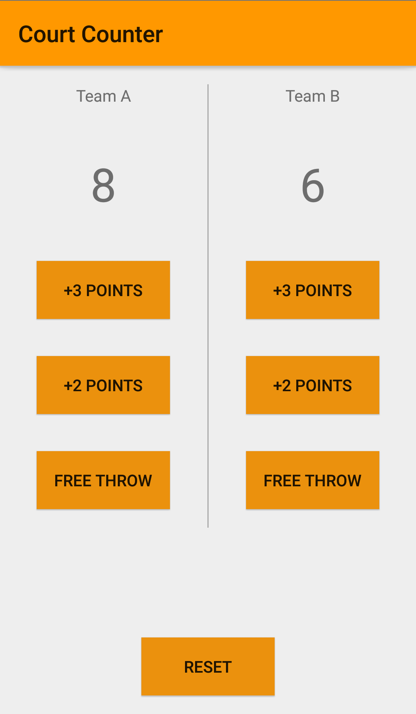

# CourtCounter
### A simple android application that counts the points of a basketball game.

### This app is made during the Udacity Android for Beginners course.

## Describtion
* the user can keep track of the game score between the two teams and then can use the reset button to reset the score.

